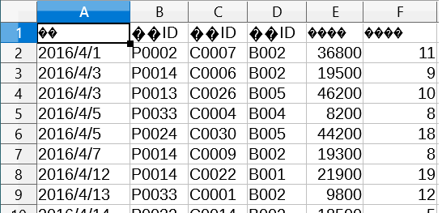
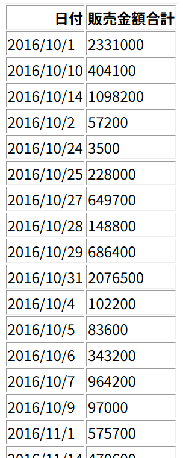
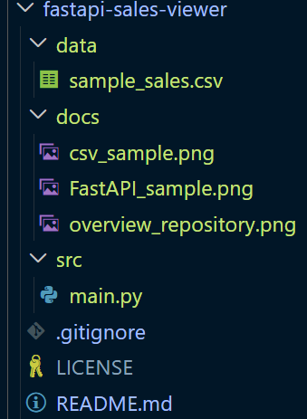

# プロジェクト概要（Overview）
## 売上データ閲覧アプリ（FastAPI）
CSV の売上データを読み込み、日付ごとの売上金額を計算・集計して Web 画面に表示するアプリです。
FastAPI と pandas を使って、シンプルなデータ集計 API を作成しました。

# インプットデータ（サンプルCSV）
このアプリは以下のような CSV を読み込みます。

文字コード：cp932（Windows の日本語用文字コード）

必須列：日付, 販売単価, 販売数量

売上金額 = 販売単価 × 販売数量　← こちらはpandasで生成します！



# アウトプット画面（FastAPI の表示結果）
ブラウザで /sales にアクセスすると、日別売上の集計結果が表として表示されます。



# リポジトリ構成（フォルダ構成）

```
fastapi-sales-viewer/
├── README.md
├── src/
│   └── main.py
├── data/
│   └── sample_sales.csv（サンプルデータ）
├── docs/
│   ├── overview.png
│   ├── sample_csv.png
│   └── output_table.png
├── requirements.txt
└── .gitignore
```



# 使い方（How to Run）
## 1. リポジトリをクローン
```bash
git clone https://github.com/t-tani-it/fastapi-sales-viewer.git
cd fastapi-sales-viewer
```

## 2. ライブラリをインストール
```bash
pip install -r requirements.txt
```

## 3. CSV の差し替え
data/sample_sales.csv を差し替えてください。
（文字コードは cp932 を想定）

## 4. アプリを起動
```bash
uvicorn src.main:app --reload
```
※ src/main.py の中にある app を起動しています。

## 5. ブラウザで確認
```コード
http://localhost:8000/sales
```
### 技術スタック（Tech Stack）
- Python 3
- FastAPI
- pandas
- uvicorn


# ライセンス（任意）
MIT License
